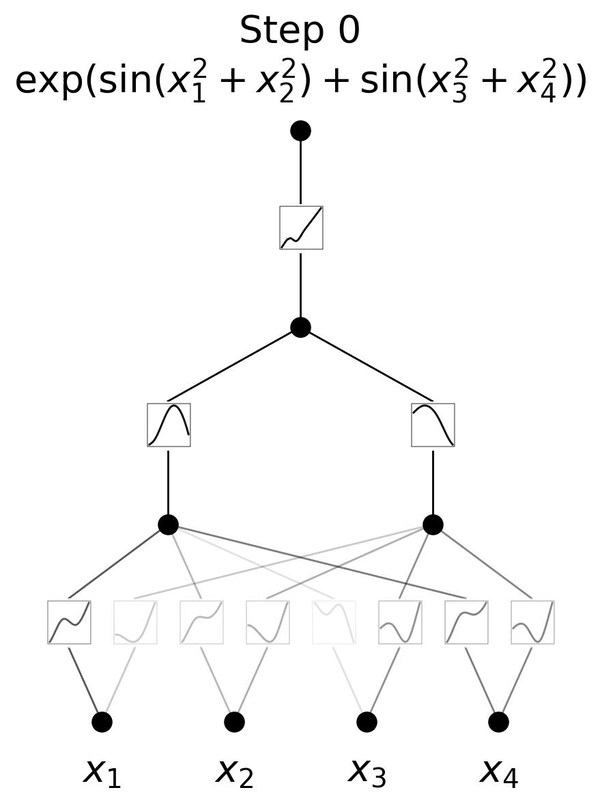

# Kolmogorov-Arnold Networks (KAN)
[](https://arxiv.org/abs/2404.19756)
### A 2024 Alternative to Multi-Layer Perceptrons with Learnable Activation Functions



## Project Overview
Developed in **2024**, **Kolmogorov-Arnold Networks (KANs)** are inspired by the **Kolmogorov-Arnold representation theorem** and represent a significant evolution from traditional **Multi-Layer Perceptrons (MLPs)**. In MLPs, nodes ("neurons") have fixed activation functions. However, in KANs, **activation functions are learnable** and applied to the **edges (weights)**, allowing the network to dynamically adjust and learn more complex functions.

KANs eliminate linear weights, replacing them with **univariate functions parameterized as splines**. This architectural change makes KANs both **more accurate** and **more interpretable** than standard MLPs. They are also smaller in size, making them efficient for a wide range of tasks, including **data fitting** and **solving partial differential equations (PDEs)**.

## Kolmogorov-Arnold Networks vs. MLPs
- **Learnable Activation Functions**: Unlike MLPs, where activation functions are fixed (e.g., ReLU, Sigmoid), KANs have dynamic, learnable activation functions placed on the edges (weights).
- **Spline-Based Weights**: KANs do not use traditional linear weights. Instead, each weight is replaced by a **univariate function**, which allows the network to learn more sophisticated representations.
- **Smaller Network Size**: KANs can achieve comparable or better accuracy than MLPs with a significantly smaller number of parameters, leading to better efficiency in both memory and computation.
- **Interpretability**: The functional form of the weights can be visualized, allowing KANs to offer intuitive insights into how the network learns and operates.

## Key Features
- **Learnable Activation Functions on Weights**: Provides greater flexibility compared to fixed activations on neurons.
- **No Linear Weights**: Weights are modeled as splines (univariate functions), enabling a more sophisticated representation of the underlying data.
- **Higher Accuracy**: Smaller KANs can outperform larger MLPs in a variety of tasks, including mathematical modeling and physics simulations.
- **Visualizable and Interpretable**: The structure of KANs can be intuitively visualized, allowing easy interaction with users to understand the inner workings of the network.
- **Applications**: Useful for data fitting, solving PDEs, and potentially (re)discovering mathematical and physical laws.

## Installation
To run the **Kolmogorov-Arnold Networks (KAN)** project locally, follow these steps:

1. Clone the repository:
    ```bash
    git clone https://github.com/your-username/kan-implementation.git
    ```

2. Navigate to the project directory:
    ```bash
    cd kan-implementation
    ```

3. Install the required dependencies:
    ```bash
    pip install -r requirements.txt
    ```

    The key dependencies include:
    - `torch` (PyTorch)
    - `graphviz`
    - `matplotlib`

## Usage
Once the dependencies are installed, you can experiment with the KAN model by running the provided scripts.

### Example Usage:
1. Define the **KAN model** and dataset:
    ```python
    input_size = 2
    layer_sizes = [2, 2, 2, 1]
    kan = KAN(input_size, layer_sizes)
    ```

2. Train the KAN model:
    ```python
    x = [[Tensor(0.25), Tensor(0.25)], [Tensor(0.25), Tensor(0.75)], [Tensor(0.75), Tensor(0.25)], [Tensor(0.75), Tensor(0.75)]]
    y = [0.25, 0.75, 0.75, 0.25]

    n_epochs = 100
    optim = Optimizer(lr=0.001)
    
    for _ in range(n_epochs):
        losses = Tensor(0)
        for _x, _y in zip(x, y):
            y_hat = kan(_x)
            loss = compute_loss(y_hat, _y)
            losses = loss + losses
        
        optim.zero_grad(kan.parameters())
        losses.grad = 1
        losses.backward()
        optim.step(kan.parameters())
    ```

3. **Visualize** the computational graph:
    ```python
    draw_dot(y_hat)
    ```

## Training the Model
The **KAN** model can be trained by feeding input and output pairs and optimizing the weights using the **gradient descent** method. This project provides an **Optimizer** class for backpropagation and gradient updates.

### Example Training Loop:
```python
for _ in range(n_epochs):
    losses = Tensor(0)
    for _x, _y in zip(x, y):
        y_hat = kan(_x)
        loss = compute_loss(y_hat, _y)
        losses = loss + losses

    optim.zero_grad(kan.parameters())
    losses.grad = 1
    losses.backward()
    optim.step(kan.parameters())
```